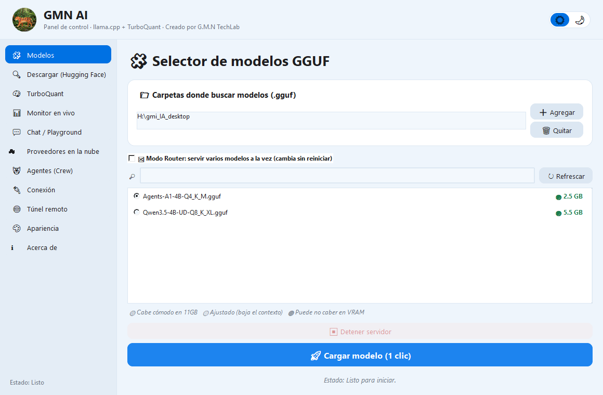
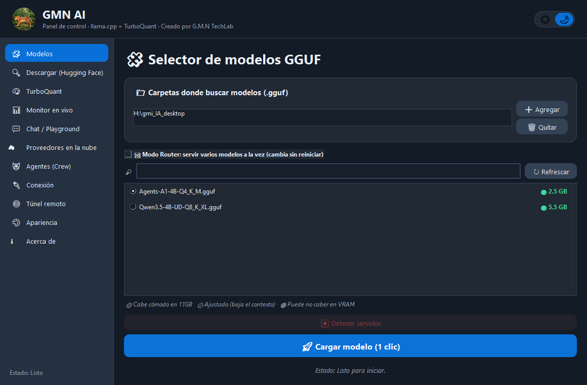

# GMN AI — point-and-click control panel for local LLMs (llama.cpp)

**Created by G.M.N TechLab.** GMN AI is a Windows desktop app that loads and runs GGUF language models with
[llama.cpp](https://github.com/ggml-org/llama.cpp) (`llama-server.exe`) **without typing a single command**.
Pick a model, press one button, and any OpenAI-compatible client (VS Code, Roo Code, Continue, Cline, OpenCode…)
can talk to it. Everything runs on your own PC; nothing leaves it unless you turn on a feature that needs the internet.

> **Interface language:** English (default). Switch to **Español** or **中文** in Appearance → Language (restart to apply).




## Download

Get **`gmn-ai-v1.1.5.zip`** from the [Releases page](https://github.com/jediknightgeorge-ship-it/gmn-ai/releases/latest),
unzip it anywhere and run `interfaz_agentes.exe`. No installer, no Python needed.

You also need **your own `llama-server.exe`** (the app does not bundle llama.cpp). Download the build that matches
your hardware from <https://github.com/ggml-org/llama.cpp/releases> — *CUDA* for NVIDIA GPUs, *Vulkan* for AMD/Intel
GPUs, or the *CPU* build if you have no GPU — and point the app to it once (TurboQuant page → "llama-server.exe Location").

**Requirements:** Windows 10/11 64-bit · GGUF models (the app can download them from Hugging Face) · a GPU is recommended but not required.

> Windows SmartScreen / antivirus may warn about the `.exe` because it is not code-signed. That is a false positive
> for a freshly built unsigned app; the full source code is in this repository.

## Quick start

1. **Models** page: add the folder(s) where your `.gguf` files are (➕ Add). You can add several folders.
2. **TurboQuant** page: select `llama-server.exe` once, then click one of the **profile buttons** at the top.
3. Back on **Models**, select a model and press **🚀 Load model (1 click)**.
4. Try it in **Chat / Playground**, or copy the endpoint from the **Connection** page into your coding tool.

## Interface languages

Switch any time in **Appearance → Language** — the app asks to restart automatically:

| | Language |
|---|---|
| 🇬🇧 | **English** (default) |
| 🇪🇸 | **Español** |
| 🇨🇳 | **中文** |

## One-click profiles (TurboQuant → Configuration Profiles)

Built-in profiles only change performance/memory options (not your model, port, API key or sampling).
Save your own with 💾 Save.

| Profile | What it does | Use it when |
|---|---|---|
| ⚡ **Fast on my GPU** | Whole model on GPU, 8k context, quantized KV cache | Model fits in your VRAM |
| 📚 **Big context, fast** | Auto-computes largest context that fits in free VRAM | You want maximum context |
| 🐘 **Big model (GPU+RAM)** | As many layers as fit on GPU, rest in RAM | Model is bigger than your VRAM |
| 🧩 **Big MoE model** | Shared layers on GPU, experts in RAM, large batches | MoE models (Nemotron, Qwen 35B-A3B…) |
| 🛡️ **Safe** | 4k context, 1 GB VRAM margin, small batches | PC is used for other things simultaneously |
| 🔵 **Qwen3.8-27B IQ2 on 2080 Ti (full GPU)** | All layers on GPU, ctx checkpoints, KV q4_0, MTP spec | Qwen3.8-27B IQ2_XS on 11 GB card |
| 🔵 **Qwen3.8-27B Q3 on 2080 Ti (RAM+GPU)** | Auto-fit, ctx checkpoints, batch 1024/512 | Q3 with partial RAM offload |
| 🔵 **Qwen3.8-27B IQ2 + MTP draft (max speed)** | Full speculative decoding with draft backend sampling | Maximum tok/s on 11 GB card |

## Everything the app does

**Loading & memory**
- **Visual model picker** for GGUF files across multiple folders, with colour hints for 11 GB VRAM.
- **TurboQuant (KV-cache quantization)** — shrinks the KV cache so you fit more context in less VRAM. Flash Attention enabled automatically.
- **Context window up to 1,000,000 tokens** (editable list; type any value).
- **Auto-fit (`--fit`) with VRAM safety margin** — the engine picks the biggest context that fits, keeping e.g. 512 MB free.
- **GPU layers (`-ngl`)** with `auto` / `all` / any number, CPU threads, batch/ubatch sizes, NUMA.
- **Load mode** (`--load-mode`: auto / mmap / mlock / none).
- **MoE offload** (`--cpu-moe`, `--n-cpu-moe`) — run models much larger than your VRAM.
- **LoRA adapters** (`--lora`, `--lora-scaled`).
- **Vision models** (`--mmproj`).
- **Context extension with YaRN** (×2 / ×4) beyond the model's training context.
- **Multi-GPU**: devices, split proportions, split mode (layer / row / tensor) and main GPU.
- **Router mode**: serve several models at once from a folder, auto-loaded on demand.

**Speed**
- **Speculative decoding**: N-gram (no extra model), **MTP** (the model's own multi-token-prediction head), or a separate draft model.
- **Context checkpoints** (`--ctx-checkpoints`) for faster reuse of long contexts.
- **Reasoning preserve** (`--reasoning-preserve`) — keep thinking state across turns.

**Quality & behaviour**
- **Sampling panel**: temperature, top-p / top-k / min-p, repetition & presence penalties, **DRY**, with presets (Anti-loops, Precise code, Creative).
- **Reasoning budget** (`--reasoning-budget`) — cap how many tokens a thinking model may spend before answering.

**Using the model**
- **Chat / Playground** with Markdown rendering and a **built-in web search tool** (DuckDuckGo, no API key needed).
- **Cloud providers**: add OpenAI-compatible endpoints or Anthropic (Claude) with your own API key — same Chat window.
- **Connection page**: ready-made config snippets for **Continue**, **Cline** and **OpenCode**.
- **Hugging Face downloader**: search models by name, pick a file, download — always with a confirmation step.
- **Remote tunnel** (cloudflared) — expose your local server outside your network (optional; needs `cloudflared.exe`).
- **Server security**: optional API key, CORS origins and timeout.

**Monitoring & looks**
- **Live monitor**: GPU usage, VRAM, temperature, CPU, RAM, and detected hardware (works with NVIDIA, AMD, Intel, or CPU-only).
- **Apple-style design**: rounded cards, one-click ☀️/🌙 mode switch, automatic colour mixing for any accent colour, WCAG-checked text contrast.
- **Multi-language UI**: 🇬🇧 English · 🇪🇸 Español · 🇨🇳 中文 — switch in Appearance, auto-restarts to apply.

## Real numbers (measured, not marketing)

Tested with llama-server b11223 on an **RTX 2080 Ti (11 GB) + AMD FX-8320E + 28 GB DDR3**:

| Model | Setup | Speed |
|---|---|---|
| Qwen 3.8 27B **IQ2_XS** | All on GPU | **≈ 19.8 tok/s** |
| Qwen 3.8 27B **IQ2_XS + MTP speculative** | All on GPU | **≈ 22–25 tok/s** |
| Qwen 3.8 27B Q3_K_M | Auto-fit, partial RAM | ≈ 3–5 tok/s |
| Qwen 3.8 27B Q4_K_M | Mostly in RAM | ≈ 1.3 tok/s |

A model that fits entirely in VRAM is dramatically faster than one that spills into RAM.

## Known limitations

- The **Agents (Crew)** tab is currently broken (CrewAI API mismatch). The rest of the app is unaffected. A fix is planned.
- Windows only.
- API keys for cloud providers are stored in plain text in a local JSON file (they never leave your PC).
- The local server has no password by default — set an API key in TurboQuant → Server Security if other devices can reach your machine.
- Some llama.cpp flags (`--fit`, `--spec-type draft-mtp`, `--split-mode tensor`) require a recent `llama-server.exe`.

## Build from source

```bash
pip install pyinstaller crewai langchain-openai psutil pillow mcp beautifulsoup4 requests
pyinstaller interfaz_agentes.spec --noconfirm
# output: dist_nuevo/gmn ai/interfaz_agentes.exe
```

Run without compiling: `python interfaz_agentes.py`

Source files:

| File | Purpose |
|---|---|
| `interfaz_agentes.py` | Main app (~3 200 lines) |
| `i18n.py` | Translation strings — EN / ES / ZH (~100 keys) |
| `estilo_apple.py` | Rounded Apple-style widgets |
| `interfaz_agentes.spec` | PyInstaller build recipe |

## Changelog

### v1.1.5 — 2026-10-10
- **Language switcher auto-restarts** — no more manual restart needed; the app offers a restart dialog the moment you change language
- **2 new Prism ML sampling presets** for Ternary Bonsai models: `🟤 Bonsai (Prism ML - pensar)` (thinking mode) and `🟤 Bonsai (Prism ML - directo)` (instruct mode)
- **5 new model profiles** inspired by the [Nichonauta](https://www.youtube.com/@nichonauta) channel:
  - `🟤 Bonsai 27B Ternary (PrismML fork)` — Ternary-Bonsai-2-27B on RTX 2080 Ti; requires PrismML fork of llama.cpp
  - `🟠 Qwen 3.5-27B IQ2 (GPU pequeña)` — Qwen 3.5-27B in extreme IQ2_XXS quantisation for 10–11 GB GPUs
  - `🟢 Qwen 3.5-9B (agéntico / rápido)` — Qwen 3.5-9B Q4_K_M, full GPU, large context, ideal for agentic use
  - `💜 Gemma 4 27B (equilibrio calidad)` — Gemma 4 27B Q4_K_M, auto-fit GPU+RAM
  - `📐 Doble contexto (KV Cache q8_0)` — doubles effective context by quantising the KV cache to q8_0

### v1.1.4 — 2026-10-09
- **Multi-language UI**: English (default) · Español · 中文 — switch in Appearance → Language
- **3 new Qwen3.8-27B profiles** optimised for RTX 2080 Ti (IQ2 full GPU · Q3 RAM+GPU · IQ2+MTP max speed)
- All UI strings extracted to `i18n.py` with ~100 translation keys
- Window title updated to `GMN AI v1.1.4`

### v1.1.3
- Qwen3.8-27B performance benchmarks, minor fixes

### v1.1.2
- Speculative decoding (N-gram / MTP / draft model)
- Reasoning budget & context checkpoints
- Context-checkpoint profiles

## Credits

Created by **G.M.N TechLab**. Built on [llama.cpp](https://github.com/ggml-org/llama.cpp) (MIT).
Inspired by the local-AI community, including the Nichonauta channel.
